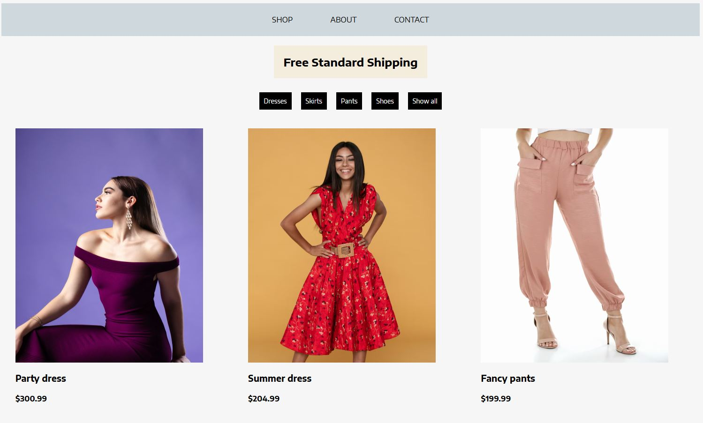

# Shopping Store

## Demo  
🔗 [View the app on Netlify](https://shopping-store-lily.netlify.app/)

## Project Description

**Shopping Store** is a small educational React project.  
The app displays product cards with images, descriptions, and prices.

At the top of the page, there are filter buttons that allow users to view specific product categories:
- Dresses
- Skirts
- Pants
- Shoes  
There is also a **"Show All"** button to display all products.

The application includes a navigation bar with three sections:
- Shop
- About
- Contacts

This project was built using React. The `.map()` method is used to render product cards, the `.filter()` method is used to filter products by category, and **React Router** is implemented to navigate between components via the navbar.

## Here's what the app looks like:

## How to Use:
- Click on the navbar links to navigate between pages.
- Click on the category buttons to filter products by type.
- Use the **"Show All"** button to display all available products.

## Features:
- Product cards with images, descriptions, and prices.
- Filtering products by category.
- Navigation between pages using React Router.
- Clean and intuitive user interface.

## Requirements:
- A modern web browser.
- JavaScript enabled.

